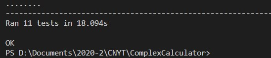
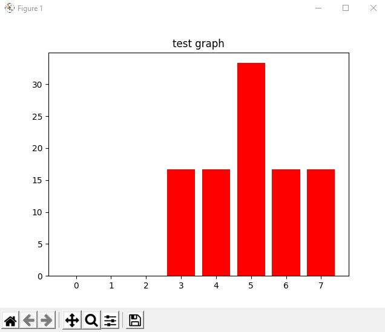
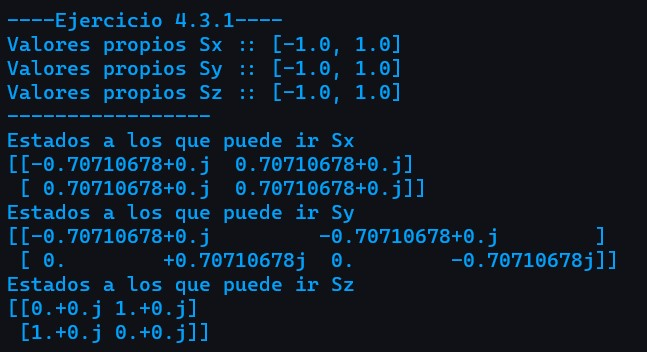
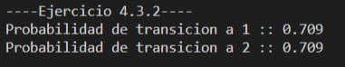
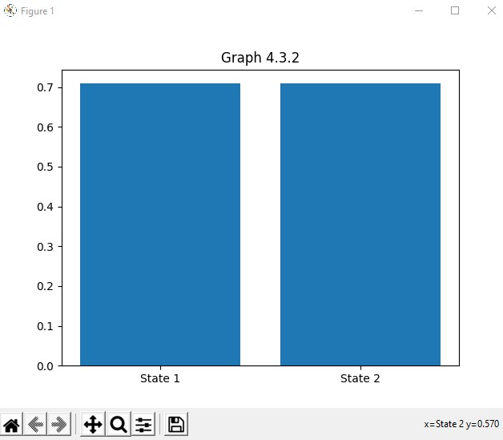
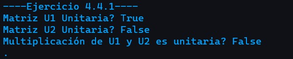
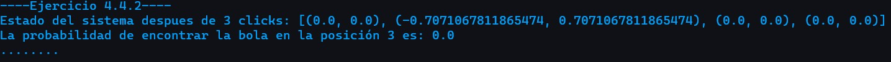

# Basic Quantum Theory
 
 ## Description

  This project was built in order to explain the Basic Quantum Theory, 
  specifically the fourth chapter from the book **Quantum Computing for Computer Scientists**
   

## Topics

1. Quamtum states.
2. Observables.
3. Measuring.
4. Dynamics.
5. Assembling quantum systems.

## Supported functions in this program

1. System's dynamic after certain number of clicks.
2. Probability given a Ket and a particula's position.
3. Mean of omega given a state (Ket).
4. Variance of omega given a state (Ket).
5. Transition amplitude given two states (Kets)
6. Transition probability.
7. Eigen values given a matriz.
8. Eigen vectors given a matriz.
9. Bars diagram given a vector with probabilities.


## User's manual

  ### Requirements
  
 1. python 3.8.
 2. The following libraries from python:
     * unittest
     * numpy
     * matplotlib.pyplot
   
**Note** if you don't have any of these libraries just execute:
```sh
  $ pip3 install <library name> 
```

  ### Execution
    
  **Clone this repository**:
 
 ```sh
  $ git clone https://github.com/JohanS11/ComplexCalculator.git
```
  **Execute the tests file**
 
```sh
  $ cd ClassicToQuantum 
  $ .\ClassicToQuantumTest.py (Windows) python3 ClassicToQuantumTest.py (Linux/Mac)
```
  
## Tests Execution

  **Note:** Close the graphs in order to continue the test execution
  
   
   
   
   
  
 **Exercise 4.3.1**
 
  
 
 **Exercise 4.3.2**
 
  
  
  
  
 
  **Exercise 4.4.1**
 
  
  
  **Exercise 4.4.2**
 
  
  

  ## Este proyecto fue construido con
  
   * [Python 3.8](https://www.python.org) Lenguaje para realizar funcionalidades
   * [Git 2.26.2](https://git-scm.com) Administrador de versionamiento
   * [Visual Studio Code](https://code.visualstudio.com) IDE para construir y modificar código.
  
  ## Author
  
   [JohanS11](https://github.com/JohanS11) Johan Sebastian Arias Amador
   
  ## License 
  
  This project is licensed under the GNU General Public License v3.0 - see the [LICENSE](https://github.com/JohanS11/ComplexCalculator/blob/master/LICENSE) file for more details.
