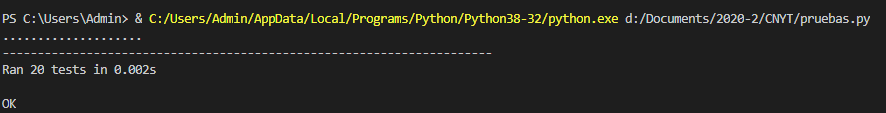
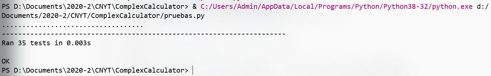

# ComplexCalculator

## Descripción

  Esta es una librería de complejos, es una herramienta para realizar cómputos entre números imaginarios dado que son la fuente
  para el estudio de la computación cuántica.

## Operaciones soportadas por la calculadora

1. Suma
2. Producto
3. Resta
4. División
5. Módulo
6. Conjugado
7. Conversión entre representaciones polar y cartesiano
8. Retornar la fase de un número complejo.
9. Adición de vectores complejos.
10. Inverso (aditivo) de un vector complejo.
11. Multiplicación de un escalar por un vector complejo.
12. Adición de matrices complejas.
13. Inversa (aditiva) de una matriz compleja.
14. Multiplicación de un escalar por una matriz compleja.
15. Transpuesta de una matriz/vector
16. Conjugada de una matriz/vector
20. Adjunta (daga) de una matriz/vector
21. Producto de dos matrices (de tamaños compatibles)
22. Función para calcular la "acción" de una matriz sobre un vector.
23. Producto interno de dos vectores
24. Norma de un vector
25. Distancia entre dos vectores
26. Revisar si una matriz es unitaria
27. Revisar si una matriz es Hermitiana
28. Calcular dinámica de un sistema (Doble rendija)

## Manual de uso 

  ### Requerimientos
  
    1. python version 3.8.
    2. La libreria unittest de python instalada.
   
  ### Ejecución
    
  **Clonar el repositorio**: ``git clone https://github.com/JohanS11/ComplexCalculator.git``

  **Ejecutar el archivo pruebas.py**

  **Para sistemas linux:** 
  
  ``cd ComplexCalculator``
  
  **Ejecutar las pruebas**:
  
  ``python3 pruebas.py o ./pruebas.py``
  
  **Para sistemas Windows:**
  
  ``cd ComplexCalculator``
  
  ``.\pruebas.py**``

  **NOTA:** Los archivos "pruebas.py" y "libreria.py" deben estar en el mismo path
  
  ## Ejecución de pruebas
  
   
   
 **Pruebas entrega 2**
 
  
 
  
   
  ## Este proyecto fue construido con
  
   * [Python 3.8](https://www.python.org) Lenguaje para realizar funcionalidades
   * [Git 2.26.2](https://git-scm.com) Administrador de versionamiento
   * [Visual Studio Code](https://code.visualstudio.com) IDE para construir y modificar código.
  
  ## Author
  
   [JohanS11](https://github.com/JohanS11) Johan Sebastian Arias Amador
   
  ## License 
  
  This project is licensed under the GNU General Public License v3.0 - see the [LICENSE](LICENSE) file for more details.
  
